<div align="center">

# FitProfile

Track measurements, brands, and style preferences

[![Live][badge-site]][url-site]
[![HTML5][badge-html]][url-html]
[![CSS3][badge-css]][url-css]
[![JavaScript][badge-js]][url-js]
[![Claude Code][badge-claude]][url-claude]
[![License][badge-license]](LICENSE)

[badge-site]:    https://img.shields.io/badge/live_site-0063e5?style=for-the-badge&logo=googlechrome&logoColor=white
[badge-html]:    https://img.shields.io/badge/HTML5-E34F26?style=for-the-badge&logo=html5&logoColor=white
[badge-css]:     https://img.shields.io/badge/CSS3-1572B6?style=for-the-badge&logo=css3&logoColor=white
[badge-js]:      https://img.shields.io/badge/JavaScript-F7DF1E?style=for-the-badge&logo=javascript&logoColor=black
[badge-claude]:  https://img.shields.io/badge/Claude_Code-CC785C?style=for-the-badge&logo=anthropic&logoColor=white
[badge-license]: https://img.shields.io/badge/license-MIT-404040?style=for-the-badge

[url-site]:   https://fitprofile.neorgon.com/
[url-html]:   #
[url-css]:    #
[url-js]:     #
[url-claude]: https://claude.ai/code

</div>

---

## Overview

Store your measurements, brand sizes, and style notes in one shareable profile. Perfect for gift-giving occasions, never make someone guess your fit details again. Features an interactive body map where you click zones to manage measurements and preferences.

**Live:** fitprofile.neorgon.com

---

## Features

- **Interactive Body Map** -- Click 9 zones (head, torso, waist, legs, feet, hands, accessories, grooming, sets) to manage measurements and brand preferences
- **Shareable URLs** -- Each profile gets a unique URL (e.g., `fitprofile.neorgon.com/p/abc123`) you can share with anyone
- **Password Protection** -- Optional password lock for profiles you want to keep semi-private
- **Basic & Advanced Modes** -- Toggle between essentials-only and detailed preferences (textures, styles, avoid lists) per category
- **Multi-Profile Support** -- Logged-in users can create and manage multiple named profiles (e.g., "My Fit", "Gift for Partner")
- **Anonymous Creation** -- Create profiles without registration; just share the link

---

## Running locally

ES modules require an HTTP server (not `file://`):

```bash
# Terminal 1: Start Convex backend
make dev

# Terminal 2: Start frontend
make serve
```

Or separately:

```bash
npm install
npx convex dev       # Backend (deploys schema and functions)
python3 -m http.server 8829  # Frontend
```

Visit `http://localhost:8829`

---

## Architecture



```
fitprofile-site/
├── index.html                # App shell with Pattern B header (auth toggle)
├── css/
│   └── style.css             # All styles including body map SVG and zone panel
├── js/
│   ├── app.js                # Entry point (loads profile from URL, renders, binds events)
│   ├── state.js              # Convex client, mutable state, loadProfile/saveProfile
│   ├── render.js             # Body map SVG, zone panels, view/edit modes
│   ├── events.js             # Click handlers for zones, forms, auth, share modal
│   ├── data.js               # 9 body zones, category schemas, default profile structure
│   └── utils.js              # escHtml, debounce, nested value getters/setters, toast
├── convex/
│   ├── schema.ts             # users, profiles tables (shareId indexed)
│   ├── auth.ts               # register, login (simple hash)
│   └── profiles.ts           # getByShareId, create, save, list, updatePassword, verifyPassword
├── docs/
│   ├── architecture.mmd      # Mermaid source
│   └── architecture.svg      # Generated diagram
├── Makefile                  # serve (port 8829), kill, dev, deploy
├── CNAME                     # fitprofile.neorgon.com
├── robots.txt                # Search engine permissions
├── sitemap.xml               # Single URL entry
└── LICENSE                   # MIT
```

### Backend

Convex tables:
- **users**: `username`, `passwordHash` (simpleHash, non-cryptographic)
- **profiles**: `shareId` (8-char nanoid), `passwordHash` (optional), `userId` (optional), `name`, `pronouns`, `photoUrl`, `data` (measurements/categories/sets), `createdAt`, `updatedAt`

### Data Model

Profile `data` field contains:
- **measurements**: chest, waist, hips, shoulders, inseam, footLength, shoeSize array, hands (ring sizes, wrist)
- **categories**: 18 categories (shirts, jeans, shoes, perfume, etc.) each with `brands` array and `preferences` object (textures, styles, colors, avoidList)
- **hair**: type, cutInstructions, products array, specialNotes
- **sets**: complete outfit collections with items array

---

## Key Interactions

**Create Profile:**
1. Visit `/` → new blank profile loads in edit mode
2. Click body zones to fill measurements and brands
3. Click "Save Profile" → generates shareId, updates URL to `/p/{shareId}`

**Share Profile:**
1. Click "Share Profile" button
2. Copy URL or QR code
3. Optionally set password protection

**View Profile:**
1. Open shared URL `/p/{shareId}`
2. If password-protected, enter password
3. View read-only profile card with measurements and brand summary
4. Click "Request Edit Access" (if password set) or "Switch to Edit Mode" (if owner) to edit

**Multi-Profile (Logged In):**
1. Click auth toggle → register or log in
2. Create multiple profiles
3. Profiles list dropdown in header to switch between them

---

## Future Enhancements

- **Cloudflare Worker + Brand API:** Search real products via ShopStyle/Amazon APIs
- **Import from screenshots:** Upload sizing tag photo → OCR extract measurements
- **Size conversion calculator:** Input one region's size → suggest equivalents (US/EU/UK)
- **PDF export:** Generate printable sizing card for wallet
- **Multi-language support:** Spanish + English

---

<div align="center">
<sub>Part of <a href="https://neorgon.com/">Neorgon</a></sub>
</div>
